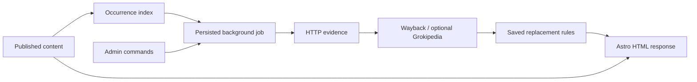

# Architecture and API

Relink separates discovery, network evidence, decisions and rendering. The native plugin uses EmDash content access, plugin storage, KV, native routes and the existing scheduler. The Astro integration calls only the in-process public route dispatcher. No EmDash core modification or visitor-side JavaScript is needed.

## Type and trust boundaries

TypeScript enables `strict`, `exactOptionalPropertyTypes`, `noUncheckedIndexedAccess`, `noImplicitOverride`, `noImplicitReturns`, unused checks and exhaustive switches. Project code disallows explicit `any`, unsafe assertions, unsafe calls/member access/assignment/returns, floating promises and type-check suppression. `skipLibCheck` skips third-party declaration internals only; all Relink source and tests are type checked. Zod schemas validate requests, configuration, HTTP provider responses and every persisted record read/write.

`CheckResult` distinguishes healthy, broken and unverifiable evidence. `ReplacementRule` distinguishes archive, Grokipedia and manual destinations. Exported declarations preserve those unions. Exceptions are durable state, not a volatile UI preference.

## Persistence and claims

EmDash owns database migrations. Relink uses declared `links`, `occurrences`, `history` and `commands` storage collections plus `settings:v1` and `worker:v1` KV entries. Domain records carry `schemaVersion: 1`; unknown versions fail validation. Plugin namespacing prevents collisions with content or other plugins.

Only the `maintenance-v1` recurring job writes decisions and job cursors. Admin requests append commands. EmDash atomically claims the task in SQL and recovers running claims after ten minutes. A tick processes at most four commands, ten published entries from one collection and four target hosts. One initial target per host is selected per tick; archive/provider traffic is bounded by the four concurrent chains. Network requests have ten-second timeouts, at most five redirects and bounded response bodies. Relink's native hook budget is nine minutes, below the host's stale-claim window. Very large sites and slow database backends require capacity testing.

Scan cursors and generations are persisted after each page. Stale occurrences are swept only after a complete collection scan; interrupted scans preserve previous entries. Orphaned links become inactive while keeping their exceptions and history. Operations are idempotent and retryable; the storage API does not offer a transaction across all records, so this is at-least-once processing, not a claim of universal exactly-once execution.

## Routes

Base path: `/_emdash/api/plugins/relink`. EmDash wraps results in its normal `{ success, data }` envelope. The client unwraps and validates it. Private routes inherit host authentication and CSRF protection; all cookie-authenticated calls require `X-EmDash-Request: 1`, and mutations additionally require `plugins:manage`. The client uses EmDash's API helper. Native route names in 0.37.0 do not select handlers by HTTP method, so every Relink handler explicitly rejects unexpected methods.

| Method and path          | Access           | Purpose                                                                                 |
| ------------------------ | ---------------- | --------------------------------------------------------------------------------------- |
| `GET /snapshot`          | `content:read`   | Filtered/paginated links or history, occurrences, totals, settings and scheduler health |
| `GET /detail?id=…`       | `content:read`   | One link, current occurrences and its latest 100 history entries                        |
| `POST /commands`         | `plugins:manage` | Queue `scan`, `check`, `exclude`, `undo`, `destination`, `reschedule` or `settings`     |
| `GET /projection?path=…` | Public, no-store | Only original/effective URL pairs belonging to a currently published page               |

Snapshot query fields: `view`, `search`, `domain`, `collection`, `contentId`, `language`, `state`, `reviewBefore` (epoch milliseconds), `offset` and `limit` (1–100). History has the same pagination. Counts are calculated from the plugin index. CSV export walks all matching link pages and neutralizes spreadsheet formula prefixes; from the History tab it exports the matching links.

The public projection discloses no excerpts, drafts, settings or history. It revalidates publication state, the current slug/path and each indexed occurrence against live content before returning mappings. It does not trust an outdated index. Automatic mappings contain a verified fragment allowlist, so a newly added section cannot inherit an unverified replacement.

## Rendering

The middleware parses HTML with parse5 and edits only anchor `href` source ranges, preserving the rest of the document. Only targets in the current page projection are changed. Image sources, scripts and other resources remain untouched. If another anchor on that page uses the same indexed URL, it receives the same rule. Preview/edit URLs, admin routes and non-HTML/partial responses are excluded.

Projection has a one-second deadline; HTML inspection has a two-second deadline and a 2 MB limit. Missing dispatch, invalid state, an outage or excessive response size preserves the original HTML. Link checking/provider calls never occur on this rendering path.
